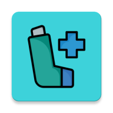
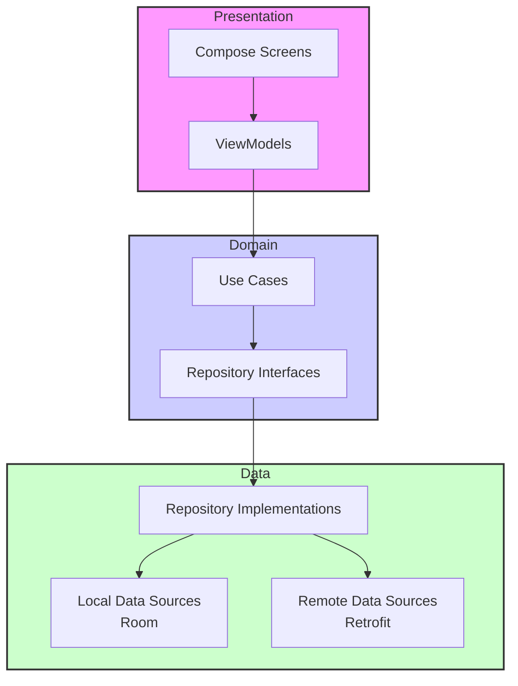

<!-- MARKDOWN LINKS & BADGES -->

 

  

  <h1 align="center">Asthma Helper</h1>
  

    <strong>Ваш персональный помощник в управлении астмой.</strong>
     
    Отслеживание пикфлоуметрии, контроль приема лекарств и мониторинг качества воздуха.
     
     
    <a href="https://github.com/Zama47/asthma_helper/releases"><strong>Скачать APK (Pre-release)</strong></a>
    ·
    <a href="https://github.com/Zama47/asthma_helper/issues"><strong>Сообщить об ошибке</strong></a>
  

 

  
📖 <strong>Оглавление</strong>

  <ol>
    <li><a href="#-о-проекте">О проекте</a></li>
    <li><a href="#-основные-функции">Основные функции</a></li>
    <li><a href="#-технологический-стек">Технологический стек</a></li>
    <li><a href="#-архитектура-и-структура-проекта">Архитектура и структура проекта</a></li>
    <li><a href="#-внешние-api">Внешние API</a></li>
    <li><a href="#-демонстрация-работы">Демонстрация работы</a></li>
    <li><a href="#-планы-по-развитию">Планы по развитию</a></li>
    <li><a href="#-автор">Автор</a></li>
  </ol>

---

## 📱 О проекте

**Asthma Helper** — это Android-приложение, созданное, чтобы помочь людям с астмой вести ежедневный контроль над своим состоянием. Оно объединяет четыре ключевых аспекта управления заболеванием:

- **Дыхание**: Трекинг пикфлоуметрии с визуализацией на графике и индикацией зон нормы.
- **Лекарства**: Составление расписания приема с умными напоминаниями.
- **Календарь**: Дневник приступов с тепловой картой, сериями без обострений и SOS-кнопкой.
- **Среда**: Мониторинг погоды, качества воздуха и уровня пыльцы, которые напрямую влияют на самочувствие.

---

## ✨ Основные функции

### 🏠 Главный экран
- **Быстрое добавление** замера пикфлоуметрии (ПФМ).
- **Виджеты** уровня аллергенности и качества воздуха (реальные данные из Open-Meteo).
- **Чек-лист** приема лекарств на сегодня с независимыми отметками о выполнении.
- **Сводка**: последний замер + норма, история записей с цветными индикаторами.

### 🌬️ Дыхание (Трекер ПФМ)
- **График динамики** пикфлоуметрии (собственный рендеринг на Canvas в стиле Material 3).
- **Три зоны нормы** (классическая пикфлоуметрия): зеленая (80–120%), желтая (50–80%), красная (< 50%).
- **Добавление замера** на **произвольную дату и время** (TimePicker).
- **Фильтр** по периоду: день / неделя / месяц / год.
- **Настройка нормы**: вручную или автоматический расчет по формуле (возраст + рост).
- **Карточка суточной вариабельности**: `(вечернее − утреннее) / максимум × 100%` с оценкой контроля астмы.

### 💊 Лекарства
- **Расписание приема**: с возможностью указать время, дозировку и **дни недели**.
- **Готовая база** из **16 предзаполненных популярных препаратов** (Сальбутамол, Будесонид, Серетид и др.).
- **Создание собственных** лекарств с индивидуальными настройками.
- **Умные уведомления-напоминания** через `WorkManager` (проверка расписаний каждые 15 минут).

### 📅 Календарь приступов
- **Тепловая карта месяца**: приступы цветом по тяжести, пропущенные приёмы лекарств — отдельной иконкой.
- **Серия без обострений (стрик)**: счётчик дней с аптеки до последнего приступа.
- **Учёт обострений**: дата/время, тяжесть, триггеры, комментарий — с редактированием и возвратом к нужной дате.
- **SOS-кнопка**: быстрый лог приступа и план первой помощи по рекомендациям GINA.
- **Статистика**: приступы за месяц, в том числе ночные.

### 🌤️ Погода и качество воздуха
- **Текущая погода**: температура, ощущаемая температура, влажность, давление, ветер.
- **Качество воздуха**: европейский индекс AQI (0–100+), концентрация PM2.5, PM10, O₃, NO₂.
- **Реальная пыльца** из Open-Meteo: береза, ольха, злаки, полынь, амброзия.
- **Персональные рекомендации** на основе AQI, уровня пыльцы и силы ветра.
- **Автоматическое определение местоположения** (FusedLocationProvider) + обратное геокодирование для получения названия города.
- **Выбор города вручную**: поиск через геокодинг Open-Meteo, выбор сохраняется между запусками (при недоступности GPS — подсказка и город по умолчанию).

---

## 🛠️ Технологический стек

Проект построен на **Kotlin** с использованием всей мощи современной экосистемы Android.

| Слой | Технологии |
| :--- | :--- |
| **Язык** | [Kotlin 2.2.0](https://kotlinlang.org/) |
| **UI** | [Jetpack Compose](https://developer.android.com/jetpack/compose), [Material 3](https://m3.material.io/) |
| **Архитектура** | **MVVM** + **Clean Architecture** (слои `data` / `domain` / `ui`) |
| **DI** | [Hilt 2.60.1](https://dagger.dev/hilt/) |
| **БД** | [Room 2.8.4](https://developer.android.com/jetpack/androidx/releases/room) (6 сущностей, `Flow`-реактивность) |
| **Сеть** | [Retrofit 2.11](https://square.github.io/retrofit/) + [OkHttp](https://square.github.io/okhttp/) |
| **Графики** | Компоновка на Canvas (Jetpack Compose) |
| **Фоновые задачи** | [WorkManager](https://developer.android.com/topic/libraries/architecture/workmanager) + `HiltWorker` |
| **Геолокация** | [Google Play Services Location](https://developers.google.com/android/reference/com/google/android/gms/location/package-summary) |
| **Сборка** | [AGP 9.1.1](https://developer.android.com/studio/releases/gradle-plugin), [KSP](https://kotlinlang.org/docs/ksp-overview.html), `compileSdk 37`, `minSdk 24` |

---

## 🧩 Архитектура и структура проекта

Проект организован по принципам **Clean Architecture**, что обеспечивает тестируемость, гибкость и независимость от фреймворков.

---

## 🎬 Демонстрация работы

| Главный экран | Добавление записи ПФМ | График пикфлоуметрии |
|:---:|:---:|:---:|
|  |  |  |

| Добавление лекарства | Окно лекарств | Погода |
|:---:|:---:|:---:|
|  |  |  |

---

## 🗺️ Планы по улучшению

- [ ] **Публикация**: release-подпись, политика конфиденциальности, выход в RuStore
- [ ] **Расширенные уведомления**: настраиваемые интервалы напоминаний, предупреждение о снижении ПФМ
- [ ] **Тестирование**: Unit-тесты для расчётов (стрик, вариабельность) и ViewModel, интеграционные тесты для Room
- [ ] **Расширенные графики**: Сравнение с нормами, тренды, экспорт данных в CSV
- [ ] **Дневник самочувствия**: Привязка записей к замерам ПФМ, теги симптомов
- [ ] **Оффлайн-кэш погоды**: последние данные без интернета
- [ ] **Адаптивный дизайн**: Поддержка планшетов и складных устройств
- [ ] **Мультиязычность**: Поддержка английского и других языков
- [ ] **Виджеты на рабочий стол**: Быстрый доступ к ключевым функциям без открытия приложения

---

## 👤 Автор

**Замышляев Антон Денисович**  

📧 [zama_47@outlook.com](mailto:zama_47@outlook.com)  
📱 [Telegram @Zamaa47](https://t.me/Zamaa47)  
🐙 [GitHub Zama47](https://github.com/Zama47) 
